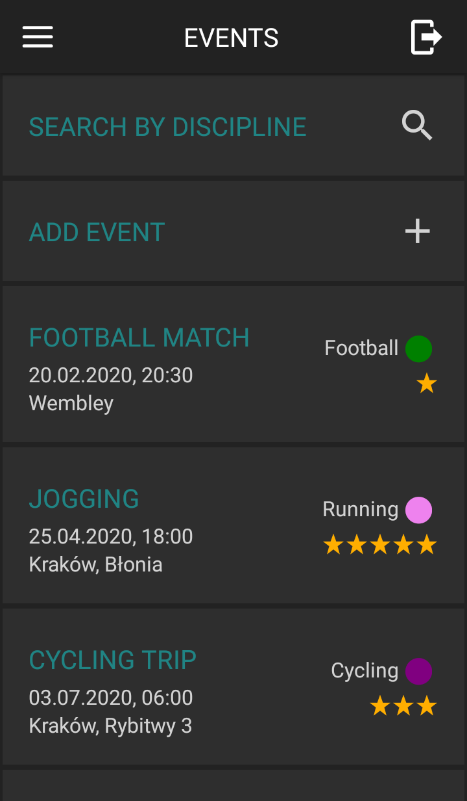
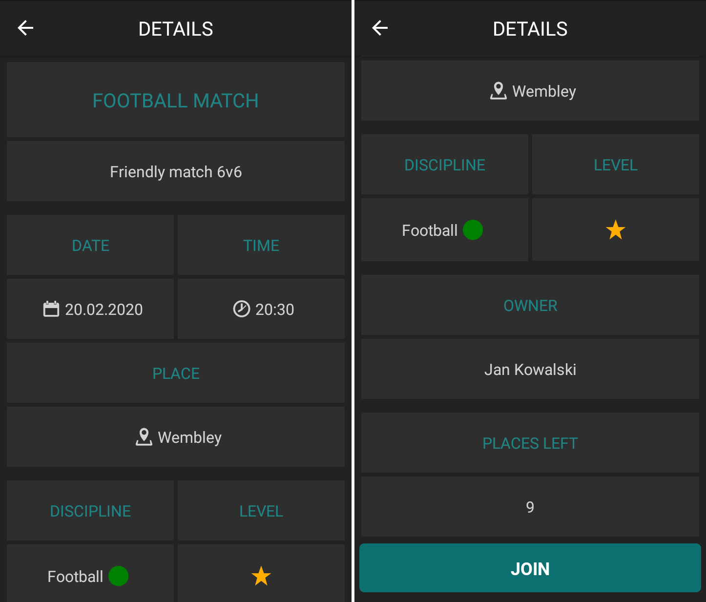
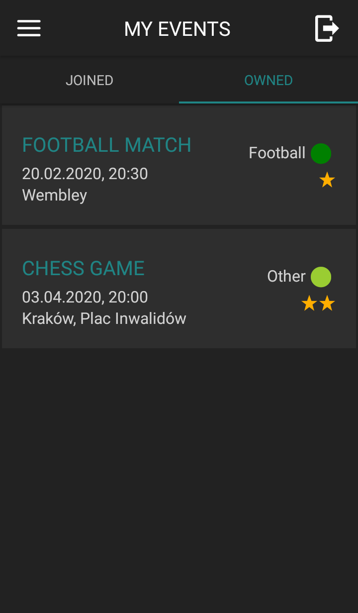

# Sport Event Search

A mobile application that allows finding partners for sports activities.
The project was implemented as a part of my Bachelor Thesis. The
topic the thesis is "Authentication process security based on the mobile application for sport activity events organization".

The source code of the backend is available [here](https://github.com/mmorawiec03/sport-event-search-server).

## Features
- creating events
- joining events
- viewing the list of events and details of each event
- viewing the user events
- creating user accounts

## Technologies
- React Native (with use of Expo platform)
- Express JS
- MongoDB

## Screenshots
### Login screen

### Home screen

### Event details

### My events

